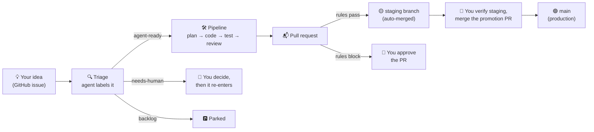

# The plain-language guide to your agent workshop

One page to answer three questions: **where does work happen, what is my
job, and where do I look?**

## The big picture

Think of it as a small workshop. You are the owner. The agents are the crew.
GitHub is the workshop's whiteboard — everything the crew knows about the
work lives there as issues, labels, and pull requests. Nothing important
lives in anyone's head (or chat history).



## Where things actually run

| Place | What runs there | When | Is it on today? |
| --- | --- | --- | --- |
| **Your Mac** (Herdr panes) | The `agent` CLI: triage, implement, review, merge, promote. Each stage is a short-lived Claude call on your subscription. | When you (or a Claude session) type a command | ✅ Yes — every run so far happened here |
| **GitHub Actions** (cloud) | The *scheduled* version of the same loop (the "Hourly Agent Triage" workflow) | Every 4 hours, unattended | ⏸ Not yet — activates when the stub workflow is committed in a managed repo |
| **GitHub.com** | Nothing *runs* here — it's the shared memory: issues, labels, PRs, the project board | Always | ✅ |

So when you wonder "where is triage running?" — today the answer is always
**your Mac, because someone typed `agent triage`**. When the Actions loop is
switched on, the same triage also happens in GitHub's cloud on a timer, and
you'd see it under the repo's **Actions** tab.

## Who does what

**Your job (the only human in the loop):**

1. **Have ideas.** File them as GitHub issues from anywhere. No polishing
   needed — triage will tell you if something is too vague.
2. **Answer escalations.** Anything labeled `needs-human` is a real question
   waiting for you (a trade-off, an ambiguity, a risky area). One comment
   from you usually unblocks it.
3. **Approve blocked PRs.** PRs that touch protected things (dependencies,
   auth, big diffs) wait for your merge instead of auto-merging.
4. **Verify staging and promote.** Pull the `staging` branch, try the app,
   then merge the *promotion PR* into `main`. **This is the one action
   agents can never do.**

**The agents' job (everything else):**

- **Triage** reads new issues *and the code*, then labels each one:
  `agent-ready` (crew can do it), `needs-human` (question for you),
  `backlog` (idea, parked).
- **Planner** (smart model, read-only) finds the root cause and writes a
  plan — or escalates instead of guessing.
- **Implementer** (fast model) writes the code in an isolated worktree.
- **Gates** (not AI — your real test/lint/typecheck commands) must pass, with
  retries on failure.
- **Reviewer** (smart model, read-only) must approve the diff.
- **Merge rules** (plain code, not AI) decide if the PR may auto-merge into
  `staging`: CI green, small enough, nothing protected touched.

## Where to look

| You want to know… | Look at |
| --- | --- |
| What is running *right now* | Herdr sidebar — tabs named `agent:issue-N` stream every action live |
| What's waiting on **me** | Issues labeled `needs-human` + open PRs (the board's "In review" column) |
| Overall state of all projects | The **Agentic Workflow** project board |
| What's about to ship | The open **promotion PR** (staging → main) — its description is the changelog |
| What the scheduled loop did (once on) | The managed repo → **Actions** tab → run summary |
| Why an issue was classified some way | The **Triage:** comment the agent left on the issue |

## How to verify staging (before merging a promotion PR)

Use a throwaway worktree so your main checkout stays untouched:

```sh
cd ~/Projects/<app>
git fetch origin staging
git worktree add .worktrees/verify origin/staging
cd .worktrees/verify && npm ci && npm run dev    # click around, check the fixes
cd ../.. && git worktree remove --force .worktrees/verify
```

(Plain `git switch staging && git pull` in your normal checkout works too —
the worktree way just avoids moving your branch while you have work open.)
Happy? Merge the promotion PR on GitHub. That's the release.

## The words that keep coming up

- **staging** — the "try it first" branch. Agents may merge here (with rules).
- **main** — production. Humans only, always via the promotion PR.
- **promotion PR** — one PR collecting everything on staging, with a
  changelog. Merging it is you saying "ship it."
- **gates** — your project's own test/lint/typecheck commands. An agent's
  work doesn't count until they pass.
- **escalation** — an agent choosing to ask instead of guess. It looks like
  a `needs-human` label plus a written explanation.
- **worktree** — a disposable copy of the repo where one task happens, so
  parallel tasks never collide.

## A real example (today, issue #12)

1. An issue was filed: "add vitest tests for checklist.ts". *(human: 1 minute)*
2. `agent triage` read it against the staging branch, labeled it
   `agent-ready`, and explained why in a comment. *(agent)*
3. It was dispatched to a Herdr tab; planner → implementer → gates →
   reviewer ran there. *(agents)*
4. Its PR touches `package.json` (a protected file), so auto-merge is
   blocked — the PR waits for a human merge. *(rules doing their job)*
5. After it lands on staging, the promotion PR updates; a human verifies and
   merges to main. *(human: the final say)*
